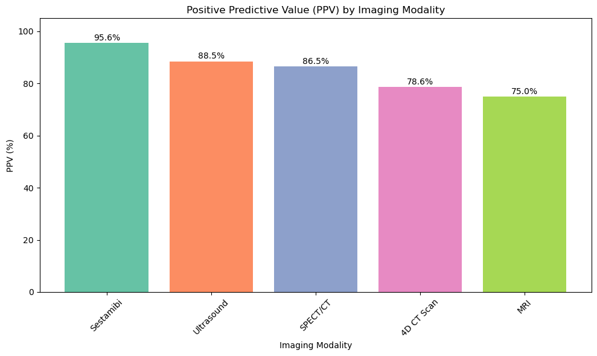
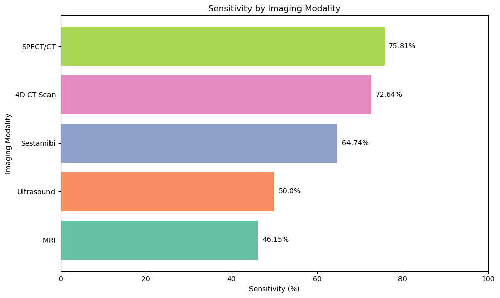
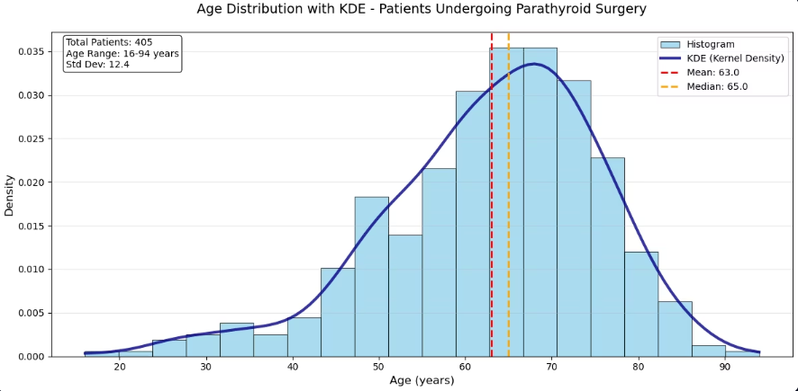
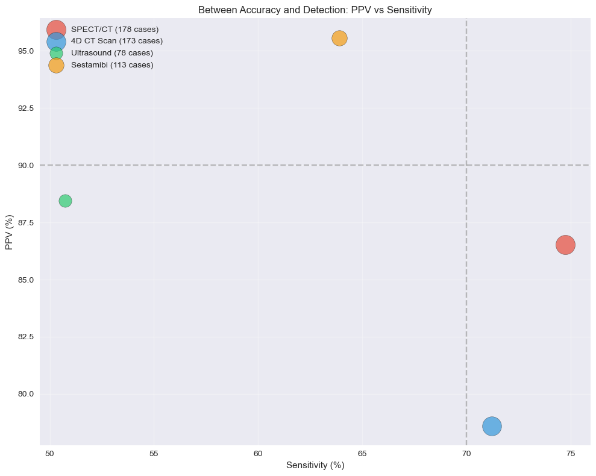
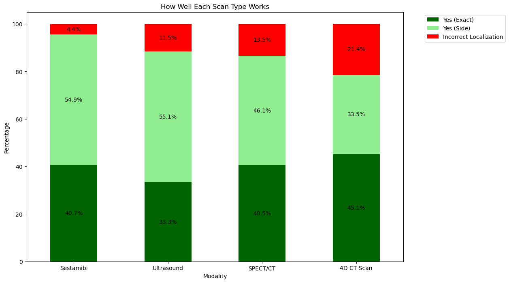
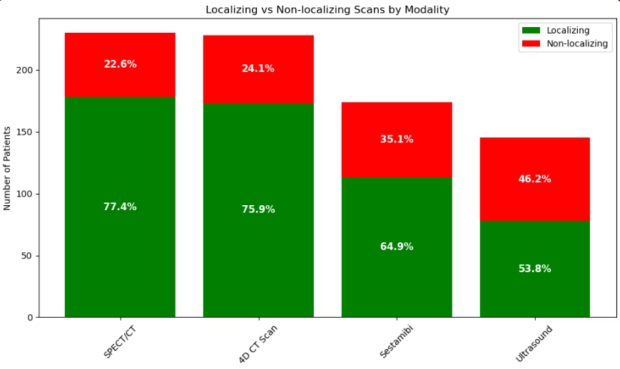
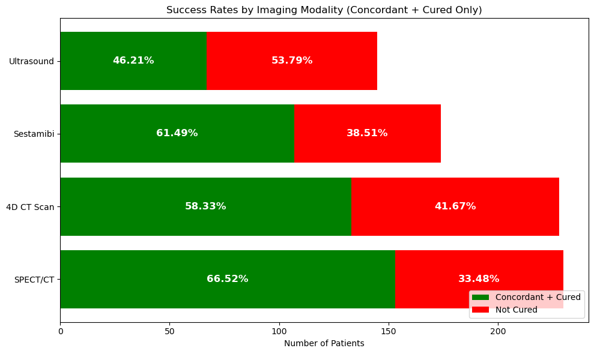

# INFO-2201 Final Project: ENT Imaging and Concordance Analysis by Jonah Schwartz & Jeshua Dimawea
<br><br>
# Overview

This project looks at different types of medical scans, like 4D CT, SPECT/CT, Ultrasound, Sestamibi, and MRI, to see how well they help doctors find the exact location of a parathyroid gland problem before surgery.

We compared what each scan showed to what surgeons actually found during the operation. Our goal was to figure out which scans are the most reliable and useful for planning surgery.

The data we used came from real patients. We cleaned and organized it so we could measure things like where the problem was (left or right side) and how closely each scan matched the real surgical result.

<br><br>

# Notes on Data Source

### Where are we getting this data from?

Our dataset came from a real hospital database. Jonah's parents is a throat surgeon, and through their work, we were able to access anonymized patient imaging records that had been collected over a 13 year period. These records included information from several common imaging modalities used in parathyroid diagnosis, like SPECT/CT, 4D CT, Ultrasound, and Sestamibi.

---

### What data type is it?

**Data**
Our data is in a table with each row being one patient procedure and each column showing different types of information of that patient. We have 405 total patient records from 2012 to 2025.

**Types of Information:**
- **Patient basics:** ID numbers, age, gender, procedure dates
- **Raw imaging results:** What each scan type reported finding (SPECT/CT, Ultrasound, 4D CT, Sestamibi, MRI)
- **Surgery outcomes:** What surgeons actually discovered during the operation and whether patients were cured

**Data Categories:**
- **Text data:** Scan results like "Left Superior", "Right Inferior", "Non localizing"
- **Numerical data:** Patient ages, ID numbers, dates
- **Missing values:** Lots of empty cells where certain scans were not performed on specific patients

**Data Challenges:**
At this point, the data shows what each scan found and what surgery found, but there is no way to compare them or know which scans were actually helpful. The imaging results are just raw reports without any analysis of how accurate it is or how useful it is for surgical planning.

---

### What are the restrictions of our data type?

- **Missing Scans:** Not every patient got all the scan types, so it’s hard to compare them directly.
- **Small Sample Sizes:** Some scans, like MRI, were rarely used, which makes it harder to trust the results.
- **Ethical Considerations:** Since this is real hospital data, we had to be careful with patient privacy. No names or personal info were used.
- **Bias Risk:** The data comes from one hospital and one surgeon, so the results might not apply to every situation or location.

---

### Pros and cons in terms of accessibility

**Pros:**  
- The data was already organized by scan type and surgery result
- It came from real cases, so it reflects real clinical situations

**Cons:**  
- The data wasn’t public, so we needed special permission to use it
- Some parts had missing or limited information, like very few MRI scans

<br><br>

# Walk Through of Data Pulling
### How did you get it?

We pulled the data from the hospital’s database with permission. Each scan result was matched to surgical findings and entered it into Excel to create a dataset. Throughout the whole thing, we were careful to avoid collecting any personal patient details and focused only on information we needed for the analysis.

**Loading It**
- Used Python's pandas library with `pd.read_excel('Data/raw_imaging_data.xlsx')`
- Put it into a 'Data' folder
- Loaded into a pandas DataFrame

**Looking at the Data**
- Ran `df.head()` to see the first few rows and understand the structure
- Used `df.info()` to check data types and see how much missing data we had
- Applied `df.describe()` to get basic statistics on numerical columns

<br><br>

# Walk Through of Data Cleaning
---
### What choices did we make?

**1. Column Name Issues**
- We found that the 'Age' column actually had a space at the end ('Age '), which was causing errors
- We just decided to strip all whitespace from all the column names to prevent future problems just in case it was just like Age

**2. Missing Data Strategy**
- We discovered lots of missing values in the imaging columns (like 175 missing SPECT/CT scans, 390 missing MRI scans)
- We had to decide whether to delete rows with missing data or keep them

**3. Data Enhancement Needs**
- The raw data only showed what each scan found, but didn't tell us if those findings were actually correct
- We realized we needed to compare scan results to surgical outcomes to make the data useful for analysis

---
### What was selected or deleted?

**What we kept:**
- All 405 patient records (no patients were removed)
- All imaging modality columns, even with missing data
- All core patient information (age, gender, surgical findings, etc.)

**What we deleted/excluded:**
- Whitespace from column headers
- We didn't actually delete any data, but we did exclude some certain values from our analysis:
  - "Non-localizing" scans when calculating success rates
  - Missing data (NaN) when doing statistical calculations
  - MRI from some analyses because it only had 15 total scans

**What we added:**
- 5 new "Calculated Concordance" columns comparing each scan type to surgery results
- 1 "Surgical Side" column with left/right information
- 1 "Success" column indicating if the patient was cured with helpful imaging

---
### Why?

**Why we kept missing data:**
- Missing imaging data actually means something important, that specific scan wasn't performed on that patient
- Deleting rows would lose valuable information about which patients got which types of scans
- This lets us see the real world usage patterns of different imaging types

**Why we added concordance columns:**
- The original data was basically useless for research because we couldn't tell if scans were accurate
- Doctors need to know "when this scan says it found something, is it usually right?"
- By comparing scan results to what surgeons actually found, we could calculate metrics like PPV and sensitivity

**Why we cleaned column names:**
- Since Python is really picky about spaces and some characters
- Clean column names prevent errors and make the data easier to work with

**Why we excluded MRI from some analyses:**
- With only 15 total MRI scans out of 405 patients, the sample size was too small for having any reliable statistics
- Including it would give misleading inferences because the numbers weren't big enough to be meaningful

After cleaning, we saved the dataset as `Clean_imaging_data.xlsx`.


<br><br>
# Reflection on Visualizations

## Implications for Visualization & Future Ideas
These visualizations helped us understand how well different scans work for parathyroid surgery. Each chart showed a different part of the story

---

## Our Visualizations
### Bar Graph - PPV 

This bar graph shows how often each scan was correct when it said there was a problem. It helps us compare how trustworthy each scan type is in giving accurate results.  

---

### Bar Graph - Sensitivity 

This graph shows how good each scan is at actually finding a problem when one exists. Higher sensitivity means fewer missed cases, which is important for diagnosis.  

---

### Histogram - Age Distribution

This chart shows the spread of patient ages in our dataset. It helped us check whether the data leaned more toward younger or older patients.  

---

### Scatter Plot - PPV vs Sensitivity

This scatter plot compares accuracy (PPV) and detection (Sensitivity) for each scan. It lets us see which scans are both reliable and catch the most problems.  

---

### Stacked Bar Chart - Concordance

This chart breaks down how often each scan exactly matched the surgery result, only matched the side, or was wrong. It gives a fuller picture of how helpful the scan was in planning surgery.  

---

### Stacked Bar Chart - Localization

This chart shows how often each scan was able to find the problem area at all. Scans with higher localization rates are more useful for helping surgeons know where to look.  

---

### Stacked Bar Chart - Success Rate

This chart connects the type of scan used with whether the patient had a successful surgery. It helped us see which scans might lead to better surgical outcomes.  

---

## Other Visualization Ideas
- **Line Chart Over Time:** To see if scan performance improved over the years.
- **Pie Charts:** For a simple breakdown of how many patients got each scan.
- **Heatmap:** To show overlap between multiple scan types per patient.


<br><br>
# Storytelling/Insight
## Our Presentation

### Reflection

Jonah and I finally finished our presentation on parathyroid imaging after weeks of research, data cleaning, analysis, and design. The goal was to see how well different medical scans (like SPECT/CT, 4D CT, Sestamibi, Ultrasound, and MRI) help doctors detect parathyroid issues before surgery.

---
### What We Did

Our storytelling was based on

> “Which imaging scan gives the most accurate and useful information for parathyroid surgery?”

To answer that, we:
- Pulled real hospital imaging data spanning over 13 years
- Cleaned and organized it for analysis
- Evaluated each imaging type based on five things:
  - **PPV** (how often the scan is right when it says there's a problem)
  - **Sensitivity** (how well it detects problems when they exist)
  - **Concordance** (how well the scan matched what surgeons found)
  - **Localization** (whether it found the problem at all)
  - **Success rate** (overall usefulness of each scan)

We then created clear visuals to help tell the story, showing where each scan type performed well and where it didn’t.

---

### What We Learned

No scan is perfect. Some scans (like Sestamibi) are super reliable when they say something’s there, but they miss a lot of cases. Others (like SPECT/CT) catch more cases but sometimes make mistakes. The best strategy is just to combine scans. That gives doctors the best chance of success in surgery.

---

### Where is this helpful?

This is helpful for doctors and radiologists who need to decide which scans to use before parathyroid surgery. Our analysis shows how different scans perform and helps explain which ones might be more reliable depending on the situation.

---

### What should other people draw conclusions about from your visualizations and cleaning?

- Different scans have different strengths. There isn’t one perfect option.
- SPECT/CT worked well most of the time, but sometimes 4D CT found things the others missed.
- Cleaning the data helped us get clearer and more accurate results.
- Some patients didn’t get every type of scan, so we can’t say one scan causes better results, just that we saw some patterns.
- Using multiple scans together can give a better overall picture.

---

### Final Thoughts

This project helped us practice data storytelling and being able to find a story in the data, making the visualizations, and wrapping it all together into a meaningful presentation. We're proud of how it turned out.


<br><br>
# Major Progress Logs

## Major Progress Log #1 – Data Access & Setup

### What We Worked On Today:
- Got permission to access anonymized patient imaging data from a hospital system.
- Exported scan and surgical records from the hospital’s internal database.
- Entered data into Excel with patient ID, scan types, and surgical outcomes.
- Saved the file as `raw_imaging_data.xlsx`.

### Notes:
- Made sure no personal identifiers were included.
- Data covers 13 years of procedures from one hospital.
  
---

## Major Progress Log #2 – Data Pulling

### What We worked on today:

- Loaded the raw imaging dataset into a pandas DataFrame
- Looked at the column names and fixed an issue with whitespace in the `'Age '` column
- Identified rows and found age data was missing
- Checked for other missing values across imaging modality columns
- Cleaned up the dataset and saved a cleaned version

### Notes:
- Will move on to making visualizations and doing analysis in a new notebook to keep this one focused on just pulling and cleaning
---

## Major Progress Log #3 - Data Cleaning

### What We Worked On Today:

- Reviewed our cleaned imaging dataset (`Clean_imaging_data.xlsx`) and realized it only showed what each scan found, but not how that matched up with actual surgical results.
- Talked about that to do analysis like PPV (Positive Predictive Value) and Sensitivity, we need to know if each modality (e.g. 4D CT, SPECT, Sestamibi, etc.) correctly matched the surgical findings.
- Decided that we needed to create new columns that compare each modality's result to the surgical outcome, like whether it was an exact match, side match, or incorrect.
- Switched focus from just using the cleaned raw data to building a Modality Concordance file that adds those comparisons.
- Created a new file `modality_concordance.ipynb` where we generate the match columns for each modality.
- Commented out the save command in `DataPreparation.ipynb`:
  ```python
  # df.to_excel("Data/Clean_imaging_data.xlsx", index=False)

- Instead, we planned to save the final version (with modality comparisons) after building it in the modality concordance notebook.
- Also added a success rate notebook file

### Notes:
- We stopped saving the cleaned version right away because it didn’t include the columns that compare scan results to surgery.
- All the analysis (like PPV and Sensitivity) now needs the updated data that shows whether each scan matched what was found in surgery.
- 

---

## Major Progress Log #4 - Visualizations

### What We Worked On Today:

- Made charts to show how well different scans (like 4D CT and SPECT/CT) matched what was found in surgery  
- Built graphs for:
  - **Concordance**: Showing exact match, side match, or incorrect match
  - **Age Distribution**: Histogram showing the realtive likelihood of falling into a certian age bracket
  - **Success Rates**: How often surgery worked depending on scan type
  - **Localization**: How often scans found the problem area
  - **PPV vs Sensitivity**: Compared trustworthiness vs how often a scan finds something
  - **PPV**: Bar graph to show the highest to lowest scores of PPV
  - **Sensitivity**: Bar graph to show the highest to lowest scores of sensitivity
- Decided what each chart means and how to explain it in the presentation

### Notes:
- The charts helped us see the different pros and cons of each imaging modailty
- We're using these graphs in our slides to try and tell the story as simple to people wihtout medical background

---

## Major Progress Log #5 - Presentation

### What We Worked On Today:

- We finished making our presentation for the parathyroid imaging study.
- Focused on making sure each slide tells part of the story clearly, for metrics like PPV, Sensitivity, and Concordance.
- Added a summary slide at the end to wrap everything up and highlight the big takeaways.
- Made sure the visualizations were easy to follow and connected to what we found in the data.

### Notes:
- We wanted the presentation to explain our findings in a way that makes sense to people who might not have a medical background.
- Each slide walks through a different part of the analysis to help answer our main question about which scan is most reliable before surgery.


